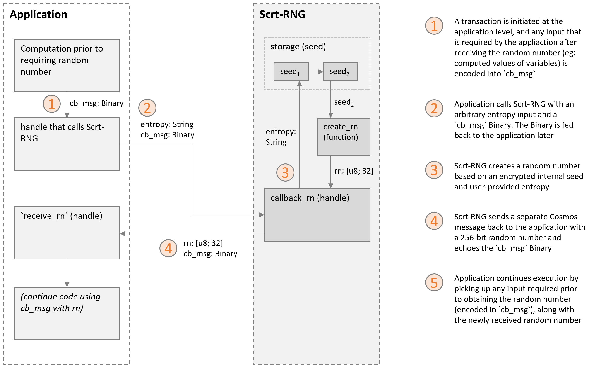
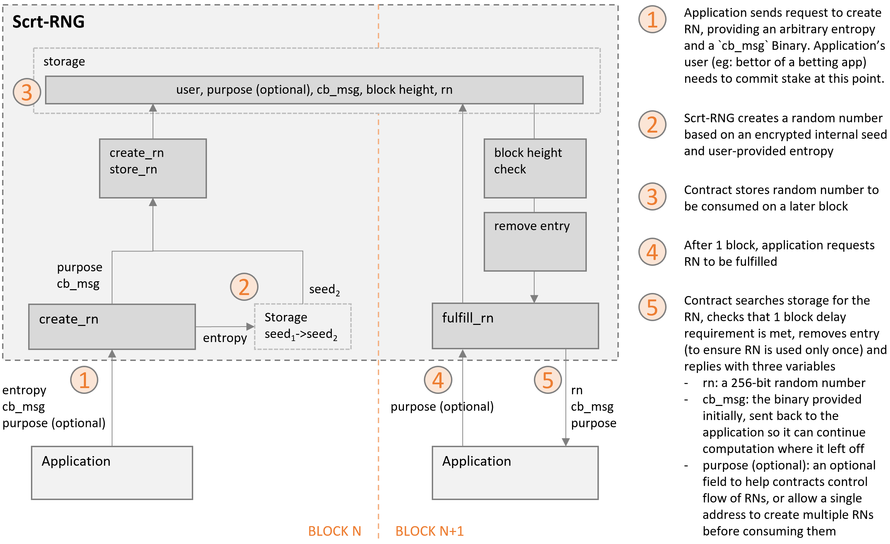

# SECRET ORACLE - RNG 

## Project description
Secret Oracle - RNG (or Scrt-RNG) will be a decentralized source of private randomness on Secret Network. It will operate fully on-chain and requires only gas fees to use. The aim is to offer a solution to private randomness which is more secure than existing solutions on Secret Network.

## What Scrt-RNG offers
* Private randomness: random number outputs produced on transparent blockchains are recorded on-chain and publicly viewable for as long as the blockchain exists. This transparency limits possible use. Scrt-RNG will transmit encrypted random numbers which are only viewable to the user.
* Secure: On-chain randomness has previously been possible on Secret Network, but existing implementations are typically exposed to various attack vectors that limit either the types of application, or the size of stakes before it becomes economically feasible for attackers to manipulate the RNG. Scrt-RNG aims to increase the cost and complexity of attacks, so higher-stakes applications can be deployed on Secret Network.
* No service fee: Scrt-RNG will be implemented such that no oracle nodes or incentivization tokens are necessary. As a result, the only fee that users pay for random numbers is the gas fee.
* Decentralized: Scrt-RNG will be implemented as one or more smart contracts. Once deployed, the core algorithm will be immutable and available to anyone with a Secret address (and later on, to the wider Cosmos ecosystem through contract-to-contract interactions through IBC). 

## Design
Scrt-RNG has two generators that share the same entropy pool: a one-transaction model and a (more secure) two-transaction model

**One-transaction model:**

**Two-transaction model:**

## How to interact with Scrt-RNG
Coming soon!

## More information
https://medium.com/@DDT5/introducing-secret-oracle-rng-a4d15e06dcf6
https://medium.com/@DDT5/secret-oracle-rng-under-the-hood-e14a505ded0a

## Licence
Apache License Version 2.0, January 2004
