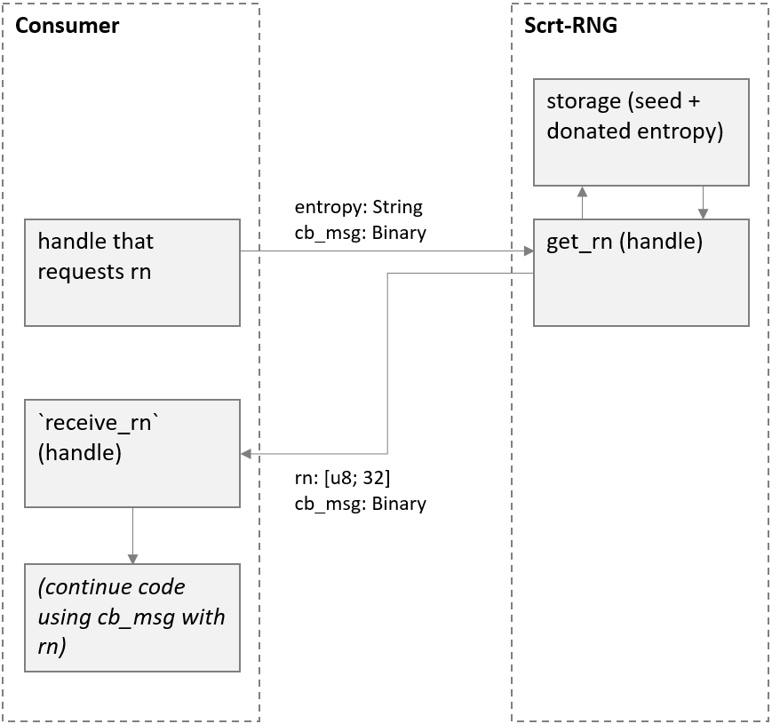

# SECRET ORACLE - RNG 

## Project description

SECRET ORACLE - RNG (or **Scrt-RNG**) will be a decentralized, trustless source of private randomness. This will be implemented as a Secret Network smart contract that crowdsources entropy to produce random numbers (RN) which will be accessible to Secret Network addresses, including other contracts.

## Problem / Solution
### 1. The need for decentralized private randomness
Current large-scale decentralized random number generators, such as Chainlink's VRF, produce random numbers which are publicly viewable. However, many applications require RNs to be private, such as when generating encryption keys.

Scrt-RNG aims to solve this by utilizing Secret Network's private computation to generate and transmit random numbers privately. 

### 2. The need for a secure generator
Security is a significant challenge for RNGs operating completely on-chain as blockchains are deterministic with no inherent randomness. Any pseudo-random number algorithm is only as secure as the entropy source which its randomness is based on. Therefore, the key is having a high entropy source.

Scrt-RNG's solution is to crowdsource entropy. Every transaction with Scrt-RNG changes the seed stored in the contract, which is used to generate  random numbers. Therefore, Scrt-RNG becomes more secure the more it is used [^fn1]. For example, if there are 10 interactions with the RNG every second, an attack likely needs to be performed within a 0.1-second window. As a result, there is a good reason for other applications to use Scrt-RNG, instead of building a similar logic within their own contracts or creating duplicates of this contract.

Scrt-RNG's implementation of crowdsourcing entropy is only possible on a computationally private blockchain such as Secret Network, as it has three important features:
- Contract storage is encrypted, so the seed is not visible to any entity except the contract itself. This is critical for security of the RNG 
- Users' entropy inputs are not visible to others. In a transparent blockchain, even if the seed is somehow concealed, an attacker can derive the current contract seed by inputting the entropy inputs in the exact sequence up to the present state. This is not possible on Secret Network as entropy inputs are encrypted  
- RN outputs are transmitted back to the user in an encrypted form, so no one can see the RN that was generated. This is an important feature given the goal of private randomness 

[^fn1]: Specifically, security increases as the average number of handle transactions per block increases

### 3. The need for a contract-friendly RNG
It is likely that smart contracts (rather than humans users) will be the primary users of Scrt-RNG.  

Although query functions are typically needed for contracts (as contracts only process `HandleResponse`s after computing their own messages), Scrt-RNG will implement handle functions in a way that allows contracts to interact with it, described in more detail further below. By implementing handle functions as opposed to queries, we achieve multiple things simultaneously:
- (Dramatically) increase security of the RNG, as every RN call will change the contract seed
- Allow the RN output to change more rapidly than block time, since queries cannot see state changes before a new block is created
- Potentially eliminate fees and the need for incentive tokens, making it cheaper to consume RN
  - every RN consumption changes the seed, so there may be no need for a dedicated entropy donation function
  - with no entropy donation function, there is no need for additional fees (collected from RN users) to fund incentives for entropy donation
 

## Detailed product description
Different implementations generally face trade-offs between cost [^fn2], security and usability. With that in mind, I will aim to implement at least two different RN-generating functions, giving RN users the choice that fits their use case.

[^fn2]: If a zero-fee implementation is possible from a security point of view (which is the aim), cost refers to gas costs

### Option 1: the default
I anticipate this to be the default function as it has high usability without sacrificing much on security or cost. 

Users call a handle function by providing two inputs -- entropy: String and cb_msg: Binary. The String is a private input which mixes with (and changes) the contract seed to generate a random 256-bit number, in the form of a [u8; 32] array. The cb_msg Binary is the message the user wants its own contract to continue processing after consuming the RN. The get_rn function echoes the cb_msg binary back to the consumer.  

This implementation should be secure unless:
1. An attacker knows the victim's entropy input. In this situation, the attacker can create a hard fork of the Secret Network blockchain, input its victim's intended entropy, and view the RN output before the victim consumes it. However, the attacker has limited time, as all this must be done within the 5-6 second block time (as each block changes the RN output), and before another user interacts with the contract (which changes the seed unpredictably) 
2. The attacker is the RN consumer him/herself. For example, a lottery dApp intending to cheat its own users may run the hard fork attack above, as it knows its own intended entropy input

As long as the user's entropy input is not known, this option should offer adequate security. However, Option 2 below aims to address these vulnerabilities for use cases that require it.

### Option 2: high security 
This will be for users who need higher security, and are able to handle a small delay between requesting an RN and receiving the RN.

The implementation will be an extension of the design above. Instead of the RN output and cb_msg being sent back to the user in the same transaction, the cb_msg is first stored in the contract. When the next user calls this function, the RN is generated with new entropy inputs and the cb_msg is echoed back. In other words, users will perform a transaction to request an RN, then must wait for a period before receiving the RN.

This adds security addressing the vulnerability described above, as the hard fork attack becomes more complex to execute and infeasible if there are high volumes of interactions with Scrt-RNG. However, drawbacks are:
- users calling this function face unpredictable gas, as they will be paying gas for processing the cb_msg from a previous user
- there is a delay between requesting an RN and receiving the RN, so a user cannot complete the execution of its code within one transaction

The implementation will include some mitigations to these drawbacks where possible.

### Option 3: A simple query function
This option is for users who value simplicity, and where security is not critical.

The main benefit is simplicity: contracts can consume RNs without the need for a receive_rn function. Also, users may be able to query random numbers without gas cost (only in limited use cases where the query does not happen as part of a transaction). Note that using query functions don't save on gas costs if it is part of a transaction.

This can be implemented as a simple query function that generates RNs based on the contract seed. A different RNG algorithm needs to be used for security.

If this option is implemented, users need to be made aware of the relatively low security compared to the previous two options. Particularly:
- Any seed change is not reflected in the output until the next block
- Inputting the same entropy in quick succession will likely result in the same RN
- An attacker can see what its victim's RN output will be beforehand, if the attacker knows the victim's intended entropy input. However, unlike the vulnerability described in Option 1, the attacker does not need to create a hard fork of the blockchain to perform this attack